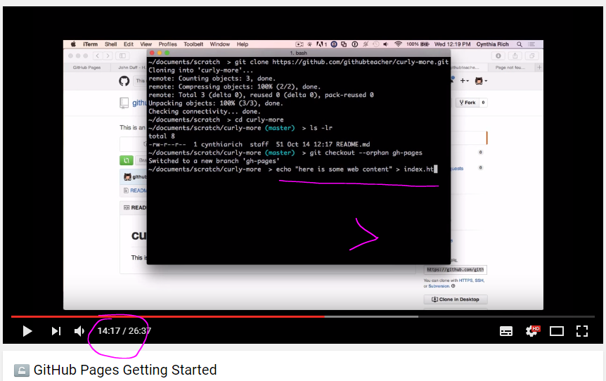

# GitHub Pages echo demo

### [GitHub Pages Getting Started](https://www.youtube.com/watch?annotation_id=annotation_3064644209&feature=iv&src_vid=2MsN8gpT6jY&v=RaKX4A5EiQo)

<<<<<<< HEAD

* [http://jmcglone.com/guides/github-pages/](http://jmcglone.com/guides/github-pages/)

* [http://blog.teamtreehouse.com/using-github-pages-to-host-your-website#comment-302784](http://blog.teamtreehouse.com/using-github-pages-to-host-your-website#comment-302784)
 
* [https://dannguyen.github.io/github-for-portfolios/lessons/deploy-github-pages/](https://dannguyen.github.io/github-for-portfolios/lessons/deploy-github-pages/)

* [http://emoji.muan.co/](http://emoji.muan.co/)

* 
=======

>>>>>>> 6382a8de5147da203f3fa4d7b7e125607698073c
